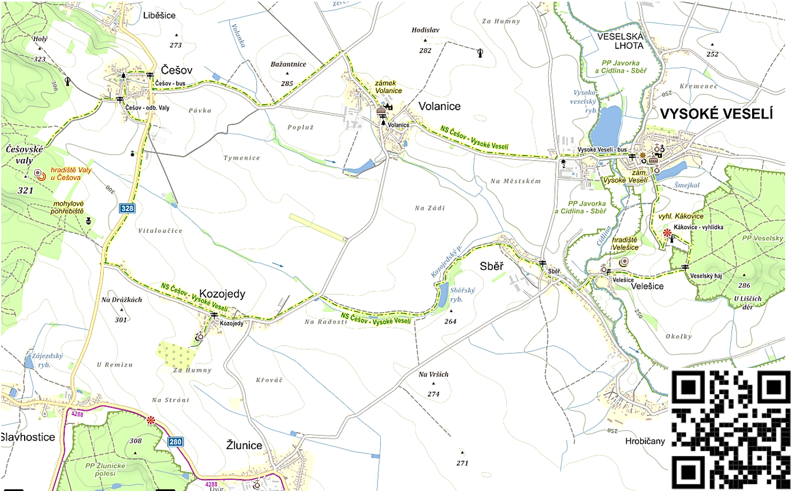

# Stezka Češov Veselí

Spolek stezka Češov Veselí spravuje a okrašluje naučnou stezku. Každý rok vždy třetí sobotu v červenci pořádá Putování po stezce Češov – Vysoké Veselí a další akce. Naše naučná stezka prochází obcemi Češov, Kozojedy, Sběř, Velešice, Vysoké Veselí, Volanice a kulturními a přírodními památkami Češovské Valy, Veselský háj.

| Adresa:| Spolek Stezka Češov - Vysoké Veselí, Češov 5, p. Jičín 506 01|
|--|--|
| IČO:| 27044041|
| email: | stezka-cesov-veseli(zavinac)seznam.cz | 

# Mapa

[trasa](trasa.html)

# Novinky a akce

## Výročí 100 let od úmrtí prof. Deyla 
pořádá Spolek stezka Češov - Vysoké Veselí a město Vysoké Veselí ve spolupráci s Konzervatoří a střední školou Jana Deyla a Základní školou Vysoké Veselí v jeho rodném městě 16.2.2024 vzpomínkovou akci:
  * Od 13:00 setkání u hrobu Prof. Jana Deyla na hřbitově ve Vysokém Veselí.
  * Od 15:00 koncert a posezení v kulturním domě ve Vysokém Veselí.

více viz [Výročí úmrtí prof. Deyla](prof.deyl.html)

## Putování po stezce – 15. 7. 2023
Zveme Vás na tradiční putování po stezce, které se letos uskuteční v sobotu 15. července 2023
- **Start:** na kterémkoli kontrolním stanovišti putování (od 9:00 do 15:00)
- Kontrolní stanoviště: Češov (náves), Kozojedy (kostel), Sběř – rybník, Velešice (kostel), Kákovice (vyhlídka), Vysoké Veselí (kostel), Volanice (hospoda), 
- **Cíl:**  na kterémkoli kontrolním stanovišti putování (od 9:00 do 15:00)
pamětní list získá každý, kdo v kterémkoli z cílových stanovišť předloží startovní lístek se třemi razítky
- **Trasy putování:** 5- 20 km (v případě vlastní trasy klidně i více;-)
- **Kudy:** většinou po trase naučné stezky, podrobné informace o trasách na všech kontrolních stanovištích
- **Jak:** pro putování doporučujeme použít kolo, ale povoleny jsou i všemožné další způsoby putování: pěšky, na koni, na koloběžce, na chůdách, na koni nebo na oslu… děti a domácí mazlíčky vezměte s sebou!
- **Startovné:** dospělí 20,- Kč, děti zdarma
- **Co Vás čeká:** les plný zvířátek (hra s tajenkou nejen pro děti), výstava panenek v historických kostýmech, dresy slavných fotbalistů, pozorování přírody, dílničky pro děti, prohlídky kostelů, MINIKONCERT (tentokrát ve Velešicích), SETKÁNÍ S VARHANÍKEM, razítka, …
- od 9:00 do 12:00 bude na Kákovicích hasičské auto a hasiči - prohlédněte si hasičskou techniku v klidu a pořádně zblízka!
- od 11:00 v Kozojedech bude průvodcovské povídání varhaníka p. Turka o kostele a jeho interieru, ve Velešicích ve 13 hod
- od 14:00 Koncert ve Velešicích - Vychutnejte si akustiku překrásného kostela Nanebevzetí Panny Marie ve Velešicích a zaposlouchejte se do tonů kytary, houslí a zpěvu. Vstup ve sportovním oblečení povolen. Trvání koncertu cca 30 minut, zdržet se můžete, jak dlouho budete chtít, začátek v 14:00.
- a další viz [Detailní informace](putovani.html)
----

[^1]: [It can take up to 10 minutes for changes to your site to publish after you push the changes to GitHub](https://docs.github.com/en/pages/setting-up-a-github-pages-site-with-jekyll/creating-a-github-pages-site-with-jekyll#creating-your-site).

[Just the Docs]: https://just-the-docs.github.io/just-the-docs/

