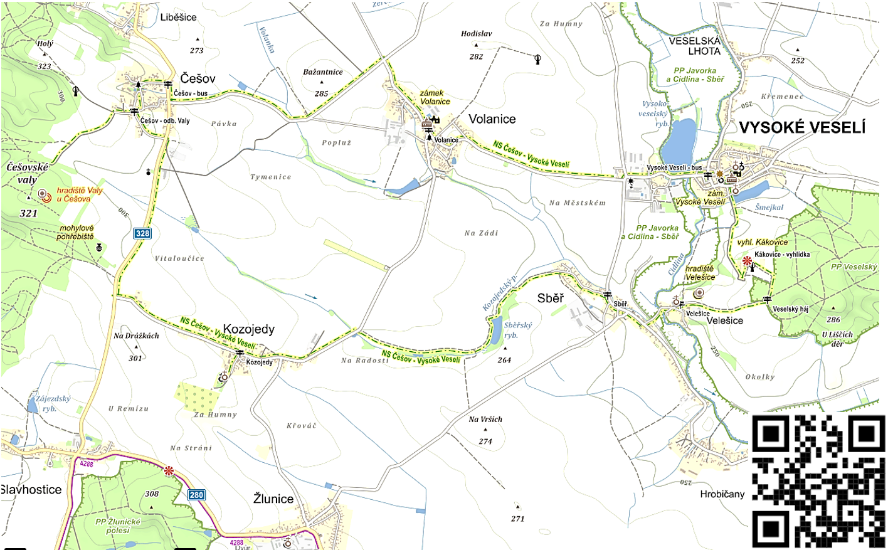
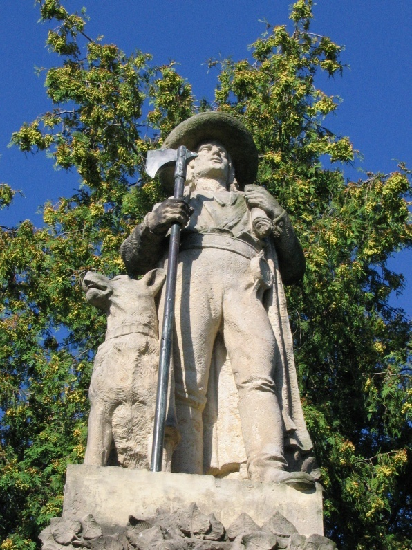
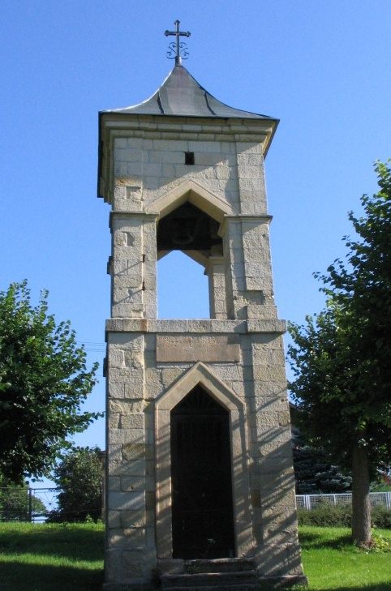
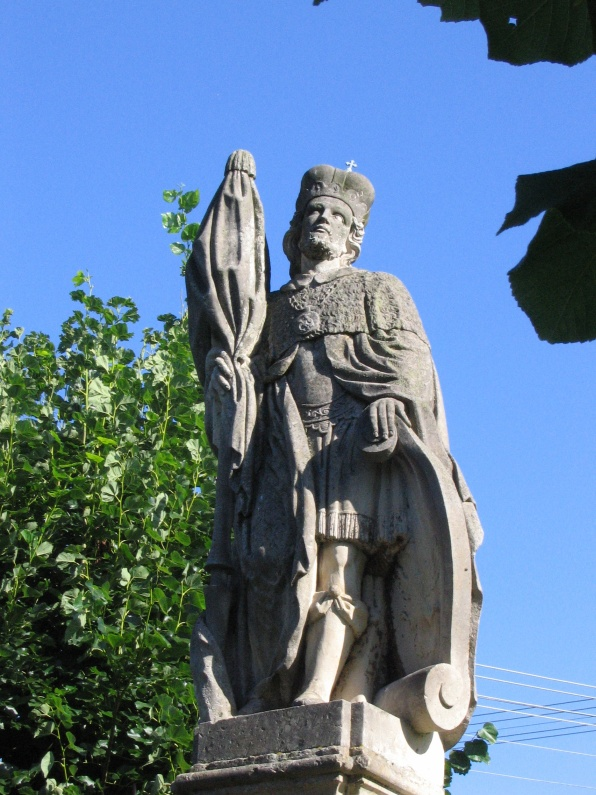
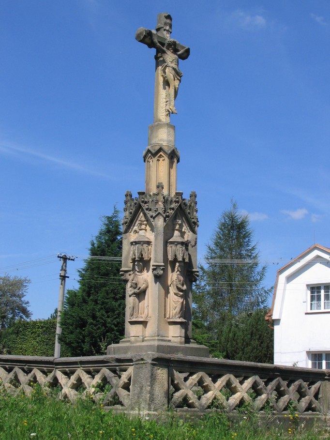

# Trasa naučné stezky

  - **Naučná stezka** z Vysokého Veselí (přes Kákovice, Veselský háj, Velešice, Sběř a Kozojedy) do Češova a zpět(přes Volanice). Trasa naučné stezky je na mapce vyznačena **červenou barvou**.
  
Stezka vede většinou po polních a lesních cestách, v obcích po chodnících, případně silnicích. Na stezce je umístěno 12 informačních tabulí s informacemi o přírodě, historii a zajímavostech okolí. Celková délka naučné stezky (včetně odboček) je 18,6 km. Trasa je vhodná pro pěší i pro cyklisty (na trekových, crosových, nebo horských kolech).

## Češov ##

Na stezku se můžete vydat třeba z Češova od hospody (blízko je také  autobusová zastávka), odkud zamíříte po značkách směr Češovské Valy - nahoru na náves. Na návski se nachází řada zajímavých staveb: 
  * zvonička, 
  * socha svatého Václava,
  * netradiční pomník padlým v první světové válce.

Na pomníku padlým v první světové válce je socha chodského strážce českých hranic, Jana Sladkého Koziny se psem, reliéf lva jako symbol české státnosti, reliéf chodské a legionářské čapky a samozřejmě jména padlých a nápis připomínající hrdinské činy legionářů i Koziny. Velkou raritou je právě socha Jana Sladkého Koziny, údajně jsou pouze 2 sochy tohoto chodského hrdiny v celé České republice, z toho jednu najdeme právě v Češově.

Trasa stezky pokračuje nahoru kolem několika roubených domků k rozcestí s křížkem. Zde se trasa stezky rozdvojuje. Slepá větev stezky vede  dále kolem "školy" (nyní Obecní úřad) po polní cestě k severní bráně Češovských Valů. Hlavní trasa stezky pokračuje po silnici směrem na Kozojedy. Doufáme, že se časem podaří napojit stezku polními a lesními cestami na nádraží v Bartoušově a také na již vyznačenou cyklostezku č. 14 (tomu však v současnosti brání velmi špatný stav polní cesty z Mrštníku do Labouně)

 Pomník obětem první světové války v Češově - horní část

 Zvonička

 socha svatého Václava

 kříž na rozcestí v Češově

## Češovské Valy ##

### Kudy povede stezka ###

K Češovským Valům vede "slepá" odbočka naučné stezky (z důvodu obtížného průchodu Češovskými Valy). 

Odbočka k Češovským Valům vede po polní cestě od "školy" (nyní Obecní úřad) k severní bráně, kde končí. V blízkosti severní brány je také pomník Tomáše Svobody, myslivce češovského, který byl popraven v době rekatolizace po bitvě na Bílé hoře. 

### Něco o Valech ###

Češovské Valy jsou jedním z několika nejlépe zachovaných opevněných sídel v České republice. Počet a rozložení valů a dalších objektů v hradišti podle Dr. Ulrychové, archeoložky Regionálního muzea v Jičíně, signalizuje skutečnost, že se jedná o několik zcela odlišných staveb zbudovaných v různých obdobích.

Pozoruhodná je výška a rozloha opevnění: 
  * Výška valů se pohybuje mezi 7 a 13 metry, průměrná šířka valů je 13 metrů (při zemi). 
  * Celková rozloha hradiště je 53,1 hektarů, vnitřní plocha téměř 40 hektarů, dovnitř hradiště by se tedy teoreticky vešlo 80 fotbalových hřišť.
  * Celkový objem valů byl určen na 494 200 metrů krychlových (do výpočtu byl zahrnut zaniklý úsek opevnění), tento objem představuje 14 885 standardních nákladních kontejnerů (rozměr standardního kontejneru: 6x2,4x2,6metrů, objem: 33,2 metrů krychlových).

{{mapa-valy.jpg?200|mapka Češovských Valů}}  {{valy-severni-brana.jpg?200|Češovské Valy - u severní brány}}  {{snezenky-ve-valech.jpg?200|první sněženky ve Valech}}    
{{img_3960.jpg?200|stará cedule KČT - jediná informace o Češovských Valech na místě}}

Češovské Valy byly postupně považovány za "velké ležení táboritů", avarský hrink, slovanské hradiště, nebo hradiště Keltů.

Kdo Valy skutečně založil je dnes velmi obtížné určit, byly zde totiž nalezeny střepy z 9. či 10. století, ale také kamený nástroj z mladší doby kamenné (blíže k mladší době kamenné viz http://cs.wikipedia.org/wiki/Neolit. Nálezy keramiky a nástrojů na Valech ukazují na sídlištní a pohřební aktivitu na tomto místě, na odkopávání a přemisťování kulturních vrstev i s nálezy. Hradiště bylo rozšiřováno, mohlo být přestavováno a doplňováno, nebo jen využíváno bez dalších zásahů do opevnění.

Hradiště Češovské Valy vzniklo nejméně ve dvou fázích: 
  * starší fáze stavby opevnění je nejspíš pravěká (hradiště lidu popelnicových polí) až raněstředověká;
  * mladší fáze stavby opevnění je středověká či novověká, nejpravděpodobněji pochází z roku 1639, kdy zde švédské vojsko postavilo dělostřelecké reduty, přistavělo ke stávajícímu opevnění tábor opevněný obdélným valem a také zvětšilo stávající opevnění.

__Zdroj použitých informací:__ publikace Češovské hradiště, Phdr. Eva Ulrychová, vydalo RMaG Jičín, 2006

Informace o Češovských Valech najdete také na stránkách:
  * [[http://www.cesov.wz.cz/]] (velmi pěkné stránky, s velmi podrobnými informacemi o Valech, mapkami, nákresy a fotografiemi; Doporučujeme!)
  * [[http://eldar.cz/hade/cesov.html]] (zde najdete hlavně fotografie z Češovských valů a základní informace o Valech)

## Kozojedy ##

Trasa stezky vede po silnici ke Kruhovoce (tj. bývalá kruhová cihelna)a dále do Kozojed. Za malou odbočku rozhodně stojí místní kostel sv. Václava. Stezka pokračuje po silnici z Kozojed směrem na Volanice, odkud po asi 100 metrech zabočuje doprava na polní cestu, která vede do Sběře.

Vzhledem k tomu, že staré polní cesty mezi Češovem a Kozojedama v průběhu let zanikly, míjí stezka několik zajímavých míst: pole U kravkova, kde prý bojoval Jan Žižka a křížek u cesty, který zde byl podle pověsti vystavěn jako obrana proti zlým silám, sedláku Vohnoutovi se tu prý zjevil ohnivý pes. [[Celé znění pověsti|Celé znění pověsti o Ohnivém psu najdete zde.]] Tento křížek je bohužel silně poničen - hlava Ježíše a hlava svatého na reliéfu jsou uraženy. 

Největší pozoruhodností Kozojed je bezesporu **kostel svatého Václava**. Je to původní gotický kostel, Současná podoba kostela pochází z roku 1689, v roce 1718 byl opraven a roku 1803 nahozen, v roce 1913 byl restaurován. Podle písemných pramenů tu byl farní kostel už v roce 1369. V roce 1428 jej pobořil Jan Žižka. 

Zajímavá je také dřevěná polygonální zvonice, která stojí nedaleko kostela. Kostel byl bohužel několikrát vykraden a není běžně přístupný veřejnosti.

Podrobné informace o tomto kostele včetně fotodokumentace a nákresů najdete na stránce [[http://home.tiscali.cz:8080/hlusice//kozojedy.html]]

{{254px-kozojedykostel_svateho_vaclava2.jpg?200|Kostel sv. Václava}} {{800px-kozojedykostel_svateho_vaclava1.jpg?200|kostel sv. Václava}} {{img_5070.jpg?200|dřevěná zvonice}} {{img_5065.jpg?120|kostel sv. Václava v Kozojedech}} {{img_5069.jpg?120|kostel sv. Václava - vchod}} {{kozojedy-pomnik-padlym.jpg?200|pomník padlým v první světové válce}} {{kozojedy-svata.jpg?200|socha}} {{img_5059.jpg?120|Jan Nepomucký - Kozojedy}} {{kozojedy-poniceny-kriz.jpg?110|poničený křížek - detail}}

V obci jsou další drobné památky: pomník padlým v první světové válce, socha sv. Jana Nepomuckého a socha P. Marie.

První písemná zmínka o obci Kozojedy je z roku 1369. Nyní zde má trvalé bydliště 211 lidí. Stále ještě tu funguje základní škola (pouze 1. stupeň).

O historii i současnosti obce Kozojedy se více dozvíte na oficiálních stránkách obce: [[http://www.kozojedy.com/]].

Kromě pověsti o ohnivém psu se ke Kozojedům váže pověst o Janovi, který byl za chrta dán. Jedná se o málo známou variaci na téma "omlazování". Zdejší babice se na rozdíl od známější Čachtické paní chtěla na omlazení použít krev panicovu (konkrétně Janovu). Celou pověst, dokonce v podobě básně, najdete rovněž  http://www.obcecr.cz/kozojedy/index.php?lang=1&level=2&id=209

## Sběř ##

{{  volanice-manas.jpg?120|socha Atlasa - původně ze Sběři, nyní podpírá balkon zámku ve Volanicích  }} {{  img_5035.jpg?120|Sběř - sv. Jan Nepomucký  }}
Z Kozojed stezka vede nejdříve cca 100 metrů po silnici směrem na Volanice a dále po polní cestě kolem rybníka do Sběři.

Ve Sběři stezka vede kolem sochy sv. Jana Křititele, dále kolem obecního úřadu (zde se rovněž nachází místní lidová knihovna s přístupem k internetu zdarma), pak odbočuje vlevo přes most přes Cidlinu, a kolem bývalého mlýna pokračuje nahoru do Velešic (tj. místní část obce Sběř).

První písemná zmínka o obci Sběř je z roku 1332. Kdysi tu stávala renesanční tvrz, ta byla později přestavěna na letní barokní zámek, který byl zbořen v roce 1786. Sochy, které kdysi stávaly ve vstupním portále tohoto zámku, nyní podpírají balkón zámku ve Volanicích.

Obec Sběř má tři místní části: Sběř, Velešice a Hrobičany. Nyní zde žije 264 obyvatel, průměrný věk obyvatel je 41 let. Více informací o historii i součastnosti obce se dozvíte na oficiálních stránkách obce: http://www.obec-sber.org/

## Zrušená trať Vysoké Veselí - Smidary ##

Ještě nedávno vedla z Vysokého Veselí do Smidar železniční trať. Naše stezka tuto dnes již neexistující trať překračuje před mostem přes Cidlinu mezi Sběří a Velešicemi.

Tato trať byla dostavěna v roce 1881, poslední vlak tudy projel 29. 5. 1976.  

Více se o zrušené trati Smidary - Vysoké Veselí dozvíte na stránkách Pardubického spolku historie železniční dopravy: http://www.pshzd.cz/veseli.html

Trať Vysoké Veselí - Smidary není jedinou zaniklou tratí na trase naší stezky. Od roku 1922 do roku 1959 fungovala úzkorozchodná trať řepařské železnice mezi cukrovarem v Kopidlně a Češovem. Tato trať byla součástí celé soustavy řepařských úzkorozchodných tratí. Nyní po ní zbyl už jen místní název "Na drážce" a stopy v krajině, které postřehne jen odborník. 

## Velešice ##
{{  img_5034.jpg?120|příjezd do Velešich od Veselského Háje  }} {{  img_5012.jpg?120|kostel sv. Anny ve Velešicích  }} {{  img_5032.jpg?120|kostel sv. Anny ve Velešicích  }}
Ve Sběři stezka odbočuje po mostku přes Cidlinu doleva a stoupá ke kostelu Nanebevzetí Panny Marie.

**Kostel Nanebevzetí Panny Marie** je výrazná stavba české lidové pozdní renesance se vzácným renesančním kamenickým dekorem. Kostel byl postaven již před rokem 1355, částečně přestavěn byl v roce 1581, loď kostela byla přestavěna Janem Baptistou Vlachem v roce 1611. Opraven byl v roce 1936. 

Uvnitř kostela jsou staré pískovcové a mramorové náhrobky, jeden z nich s ostatky Mikuláše Bořka Dohalského z Dohalic. Před hlavním oltářem je hrobka s letopočtem 1700, která byla určena pro rodinu Zárubovu, zůstala však prázdná. Ve hřbitovní zdi jsou zasazeny čtyři náhrobky rodiny Volanských z Volanic z konce 16. století. 

Kostel byl původně spojen s tvrzí na návrší, nejspíše chodbou vedoucí do zrušené oratoře nad dnešní sakristií. 

Pozoruhodné jsou také **památné lípy** na prostranství před kostelem. 

## Chráněná území ##

Na první z následujících mapek jsou vyznačeny 2 oblasti, které patří do soustavy chráněných území podle směrnic EU a zákona o ochraně přírody ČR - http://www.nature.cz/natura2000-design3/sub.php?id=1802 Prvním z nich je tzv. evropsky významná lokalita podél toku řek Cidlina a Javorka, druhým je evropsky významná lokalita Veselský háj.

Na druhé mapce je vyznačeno území přírodní památky Veselský háj a rybník Smrkovák.

{{mapa-natura1.png?450|mapka naturových oblastí v okolí Vysokého Veselí}} {{mapa-pp1.png?450|mapka chráněných území v okolí Vysokého Veselí}}

Zdroj: http://geoportal.cenia.cz/mapmaker/cenia/portal/index.php?lang=cz&mode=tasks&win_size=1&dict_shifter=0&ptz_shifter=0&adres_shifter=0&ptz_filter_id_active=&adres_filter_id_active=&kod_obj=&rect=-672754%3A-1032779%3A-659114%3A-1023231&xy=&xy_label=&use_user_rect=&tree_dict_idobj_active=45&tree_dict_parent_active=1&tree_name_active=Ochrana+%BEivotn%EDho+prost%F8ed%ED&dict_idobj=45&lokal=-672754%3A-1032779%3A-659114%3A-1023231&win_size_exter=2%7C950%7C740

Více informací o této lokalitě  Veselský háj na české wikipedii http://cs.wikipedia.org/wiki/Veselský_háj_a_rybník_Smrkovák
http://www.nature.cz/natura2000-design3/web_lokality.php?cast=1805&akce=karta&id=60923|Natura 2000 - Veselský háj]],  [[http://www.nature.cz/natura2000-design3/web_lokality.php?cast=1805&akce=karta&id=60941|Natura 2000 - Cidlina a Javorka]]

## Cidlina a Javorka ##
{{  modrasek-bahenni.jpg?150|modrásek bahenní }} {{  velevrub-zvenku.jpg?120|velevrub tupý - lastura zvenku  }} {{  velevrub-zevnitr-prazdny.jpg?120|velevrub tupý - vnitřek lastury }} 
Toto území zahrnuje tok řeky Cidliny od Veselské Lhoty až k soutoku Cidliny s Javorkou u Smidar a přilehlé louky kolem Cidliny. Naše stezka překračuje Cidlinu (a tedy i tuto evropsky významnou lokalitu) mezi Sběří a Velešicemi. 

Předmětem ochrany je zde mlž - **velevrub tupý**. Cidlina a Javorka jsou jednou z 10 nejvýznamnějších lokalit výskytu tohoto mlže v České republice. 

Velevrub se živí filtrací planktonu z vody. Je odděleného pohlaví. Samice vypouští v létě do vody velké množství larev (tzv. glochidií). Tyto larvy pak parazitují v žábrách ryb. Velevruby se dožívají obvykle 10 až 15 let, za příznivých podmínek to však může být až 50 let.

Dalším významným druhem této lokality je **modrásek bahenní**. Tento motýl obývá louky v okolí Cidliny. Jeho barva je překvapivě spíše hnědá: samice jsou hnědé, samci mají mají na jedné straně křídel modrý odstín (na hnědém podkladu). Obrázky tohoto motýla najdete na [[http://www.biolib.cz/cz/taxonimage/id9688/?taxonid=51451|webu www.biolib.cz]]. Hostitelskou rostlinou housenek je toten. Zajímavostí je že ve čtvrtém vývojovém stádiu housenka padá na zem, kde ji vyhledají dělnice mravenců, odnesou ji do mraveniště - zde se pak housenka živí larvami a kuklami mravenců zhruba po dobu 10 měsíců. Po přezimování se v hnízdech mravenců také kuklí.

## Veselský háj ##
Od Velešic vede do Veselského háje polní cesta, po které také vede naše stezka. Značení Vás provede Veselským hájem na vyhlídku na Kákovicích.
{{veselsky-haj-vystup.jpg?150|Veselský háj, střelnice}}{{veselsky-haj.jpg?330|Veselský háj}}{{veselsky-haj-vstup.jpg?150|Veselský háj, vstup z Kákovic}}

Veselský háj byl vyhlášen přírodním památkou a zároveň je evropsky významnou lokalitou (Natura 2000).

Veselský háj je jedním z nejzachovalejších lesních celků v oblasti mezi Hradcem Králové a Jičínem. Vyskytují se zde dubohabřiny a vlhké acidofilní doubravy, místy také mokřadní ošiny. 

{{img_4392.jpg?85|sasanka hajní}} {{img_4413.jpg?85|dymnivka dutá}} {{img_4418.jpg?85|Veselský háj - 7.dubna 2007}} {{img_4419.jpg?150|sasanka}}  {{dymnivka-bila1.jpg?150|dymnivka bílá}} {{jahodnik-truskavec.jpg?150|jahodník}} {{marinka-vonna.jpg?90|mářinka vonná}} 

Nejkrásnější je Veselský háj na jaře, kdy zde najdeme překrásný bílo-fialový koberec ze sasanek hajních a dymnivek dutých, kterým se tu říká kohoutky.

Později zde rozkvetou a celý les provoní konvalinky. V létě sem lidé chodí hlavně kvůli houbám a lesním plodům (hlavně ostružinám a borůvkám).

Roste tu řada vzácných bylin. Seznam bylin jsme převzali ze stránek Natura 2000 a Wikipedie. Byliny uvádíme v abecedním pořadí.
Dymnivka dutá,
hrachor černý,
hrachor jarní,
jahodník truskavec,
konvalinka vonná,
kosatec žlutý,
kostival český, 
lakušník okrouhlý, 
lilie zlatohlavá, 
mařínka vonná, 
medovník meduňkolistý, 
mochna bílá, 
ochmet evropský, 
oměj pestrý, 
plicník lékařský, 
pryšec kosmatý, 
řimbaba chocholičnatá, 
sasanka hajní, 
sasanka pryskyřníkovitá, 
sevlák širolistý (potoční), 
srpice barvířská,
strdivka zbarvená, 
vemeník dvoulistý, 
vikev lesní, 

## Kákovice, vyhlídka ##
{{  kakovice-vysilac.jpg?83|Kákovice vysílač Vodafone}} {{  kakovice-panorama.jpg?350|Panorama z Kákovic}}{{  kakovice.jpg?150|Cesta kolem Kákovic}} 
Kákovice, u vysílače mobilního operátora, s vyhlídkou na Vysoké Veselí a při dobré viditelnosti i dál. Umístili jsme sem informační tabuli s popisem kopců, které jsou odtud vidět a také vyhlídkovou lavičk, která je velmi oblíbená. Už při stavbě naučné stezky jsme tu prořezali křoví, které bránilo výhledu na severozápad. Na údržbě vyhlídky se v současné době podílí také město Vysoké Veselí.\\
Vysílač byl postaven r. 2000 a nepočítalo se s instalací rozhledny, další informace o této stavbě vysílače viz Nové Noviny např. [[http://www.jicinsko.cz/nn/99/16/nn916-1.htm]] [[http://www.jicinsko.cz/nn/00/10/nn010-2.htm]] 
\\

## Vysoké Veselí ##
{{  vysoke-veseli-erb.jpg?150|Erb Vysokého Veselí}}{{  rybnicni-kostel.jpg?150|Památník a kostel}}
### Kudy povede trasa stezky ###

Trasa naučné stezky povede přes Mírové náměstí (tj. hlavní náměstí s parkem), přes Václavské náměstí, kolem kostela a dál kolem rybníka Šmejkal směrem na Kákovice a do Veselského háje. Druhým směr naučné stezky povede kolem hasičské zbrojnice, Velkého rybníka (retenční nádrže) do Volanic a dále do Ćešova.

### Zajímavosti Vysokého Veselí ###

**Mírové náměstí** je hlavním náměstím Vysokého Veselí, ještě před 50 lety bylo náměstí volným prostranstvím s **Mariánským sloupem**. V době největšího rozkvětu Vysokého Veselí se tu konaly největší dobytčí trhy v kraji. V letech 1957-59 zde byl vytvořen park, kašna v parku je typickým výtvorem tzv. [[http://cs.wikipedia.org/wiki/Socialistick%C3%BD_realismus|socialistického realismu]]. Ideologicky nežádoucí mariánský sloup byl odstraněn, později (v roce 1977) byl tento sloup umístěn u kostela sv. Mikuláše Tolentinského, kde jej najdeme i dnes. Na Mírovém náměstí najdeme městský úřad, poštu a několik obchodů. Stoji zde také nejstarší dům městečka: jde o **velký patrový renesanční dům  s podloubím** a českým nápisem nade dveřmi. Tento dům byl postaven v roce 1586. Nápis nade dveřmi naznačuje mimořádné postavení majitele domu v městečku.

Veselské **Václavské náměstí** je asi 50 metrů od Mírového náměstí, je zde socha **sv. Václava** a zeď, kde je vytesán **erb Vysokého Veselí** a **renesanční reliéf s erbem majitele panství a delfíny**, kteří vypadají spíš jako krokodýli. 

**Kostel sv. Mikuláše Tolentinského** stával ve Vysokém Veselí odedávna. První písemná zmínka o tomto kostele je z roku 1335. Kostel, stejně jako většina městečka, několikrát vyhořel, jeho původní podoba se proto nedochovala. Základ současné podoby kostela je z roku 1770, tehdy byl postaven zcela nový kostel v  [[http://cs.wikipedia.org/wiki/Baroko|barokním slohu]]. I ten však vyhořel a po požáru byl [[http://cs.wikipedia.org/wiki/Emp%C3%ADr|empírově]] přestavěn do své nynější podoby. 

**Kdo byl sv. Mikuláš Tolentinský?** Snad každý zná jeho známějšího jmenovce, [[http://cs.wikipedia.org/wiki/Svat%C3%BD_Mikul%C3%A1%C5%A1|Mikuláše z Myry]], který rozdává každý rok v předvečer svého svátku (6.12) dětem dárky... Mikuláš Tolentinský žil téměř o 1000 let později než Mikuláš z Myry. Narodil se v Itálii v roce 1246, už v 18 letech vstoupil do augustiniánského řádu. Usadil s v Tolentinu, kde vykonal řadu dobrých skutků a zázraků. Staral se o chudé, rozdával chudým chléb, navštěvoval vězně... K zázrakům, které vykonal patří například oživení stovky dětí, které zemřely hladem, záchrana pasažérů lodi v bouři a řada dalších. V minulosti byl tento světec poměrně oblíbený. Jeho sochu najdeme například i na Karlově mostě v Praze. Více o sv. Mikuláši Tolentinském najdete na [[http://en.wikipedia.org/wiki/Nicholas_of_Tolentino|stránkách anglické wikipedie]]

**Zámek ve Vysokém Veselí**

Ve Vysokém Veselí najdeme několik **památek lidového sochařství**. Přímo na trase stezky je socha **sv. Václava**, ta je umístěna na Václavském náměstí, sochu **sv. Jana Nepomuckého** najdeme u mostu přes Cidlinu (přímo před hasičskou zbrojnící), toto umístění je pro sochy tohoto světce typické. Poněkud mimo trasu stezky je socha **Piety** na Novém městě a socha světce u silnice směrem na Sběř, další tentokrát kovový křížek na podstavci s reliéfem je umístěn na křižovatce silnic na Nevrátice a k pyrámu. Řadu dalších zajímavých soch najdeme na místním hřbitově (ten leží na plánované trase naučné stezky - za rybníkem Šmejkal směrem ke Kákovicům)

### Historie Vysokého Veselí ###

### Slavní rodáci a obyvatelé Vysokého Veselí ###
**Prof. Jan Deyl**, významný oční lékař a zakladatel ústavu pro slepce v Praze. Konzervatoř a střední škola pro zrakově postižené v Praze na Malé straně stále nese jméno tohoto lékaře. Nedaleko Mírového náměstí je rodný domek Jana Deyla s pamětní deskou.

**Karel Vacek**, významný hudební skladatel. Proslavily ho písně "Cikánka", "Nikdy se nevrátí pohádka mládí" a "Čtyři páry bílých koní". Karel Vacek se narodil v Liberci a zemřel v Praze. Do Vysokého Veselí však rád a pravidelně jezdil. Složil tu řadu svých skladeb. Každoročně se zde koná festival "Vackovo Vysoké Veselí".

**Matěj Buva**, místní továrník. Ve Vyskokém Veselí dal postavit a provozoval první továrnu na cikorku (kávovou náhražku z čekanky) v Rakousko-uherském mocnářství.

### Další informace o Vysokém Veselí ###

Podrobné informace o Vysokém Veselí jsou na stránkách obce http://www.vysokeveseli.cz/ a zatím neúplné informace v české Wikipedii [[http://cs.wikipedia.org/wiki/Vysoké_Veselí]] 

## Volanice ##

Z Vysokého Veselí se trasa naučné stezky vrací po silnici lemované ořechovým stromořadím přes obec Volanice do Češova, kde se okruh naučné stezky uzavírá. 

Bezesporu největší zajímavostí obce Volanice je **barokní zámek** se sochami dvou [[http://cs.wikipedia.org/wiki/Atlant|Atlantů]] v průčelí. Zdejší Atlantové na svých ramenou nesou balkón v průčelí zámků. Tyto sochy původně stály u zámku v nedaleké obci Sběř, tento zámek však zanikl již v roce 1786. Zámek momentálně patří obci, která jej v současné době nevyužívá.

K zámku patřily budovy zámeckého statku, které najdeme hned vedle zámku. 

V obci najdeme řadu **památek lidového umění**. Například několik roubených chalup, zvoničku a sochu Panny Marie. Důležitou památkou je také **pomník padlým v první světové válce**, který najdeme u hřbitova.

První písemná zmínka o obci Volanice je z roku 1325, momentálně tu trvale žije 220 obyvatel. V obci funguje mateřská školka. Více o historii i současnosti obce Volanice se dozvíte na | [[http://www.volanice.cz/index.php|webových stránkách obce Volanice]]

Určitě se zastavte na dětském hřišti u mateřské školy. Je volně přístupné a je na něm umístěna trojramenná lavice se stoly, která se výborně hodí k posezení a občerstvení z vlastních zásob.

# Značení 
[[Značení a směrovky:start|Značení a směrovky]]

~~META:
subject     = naučná stezka, Češov, Češovské valy, Kozojedy, Sběř, Velešice, Veselský háj, Vysoké Veselí, Volanice, Cidlina a Javorka, železniční trať Vysoké Veselí - Smidary, Mikuláš Tolentinský, Volanice, Jan Deyl, Karel Vacek, Matěj Buva, Jan Kozina
~~